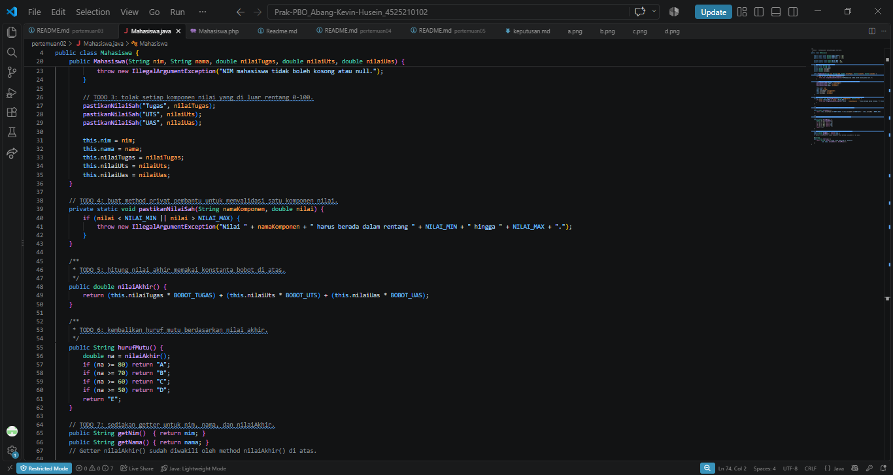
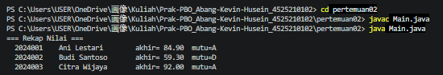
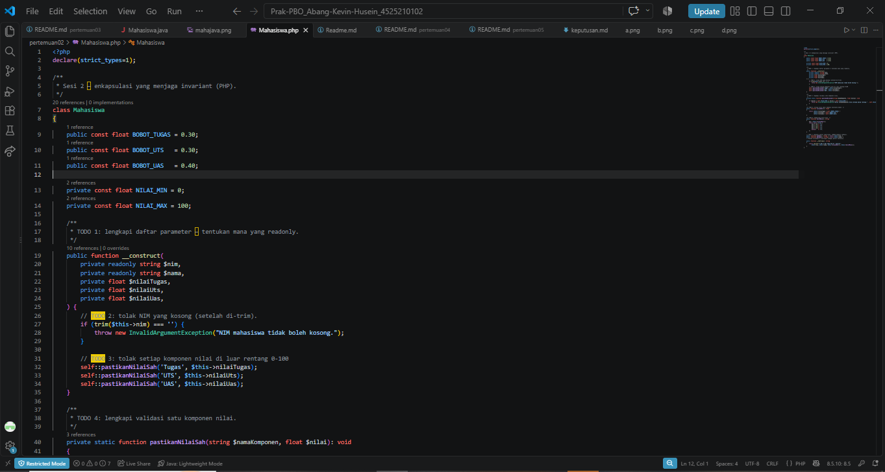

# LAPORAN PRAKTIKUM PEMROGRAMAN BERBASIS OBJEK

| Informasi Praktikan | Keterangan |
| :--- | :--- |
| **Nama** | Abang Kevin Husein |
| **NPM** | 4525210102 |
| **Kelas** | A |
| **Mata Kuliah** | Pemrograman Berorientasi Objek (PBO) |
| **Pertemuan** | 2 - Enkapsulasi dan Penjagaan Invariant |
| **Tanggal** | [Isi Tanggal Praktikum] |

---

## 1. Implementasi Java

### 1.1. File: `Mahasiswa.java`
**Penjelasan Kode:**
> File ini mendemonstrasikan konsep enkapsulasi untuk menjaga *invariant* (aturan baku yang tidak boleh dilanggar) pada kelas `Mahasiswa`[cite: 34]. Atribut seperti `nim` dan `nama` dideklarasikan menggunakan kata kunci `final` agar nilainya tidak dapat diubah lagi setelah objek dibuat[cite: 34]. Terdapat logika validasi di dalam *constructor* untuk menolak nilai NIM yang kosong dan rentang nilai yang berada di luar 0-100 dengan melemparkan `IllegalArgumentException`[cite: 34]. Nilai akhir dihitung menggunakan konstanta bobot (30% tugas, 30% UTS, 40% UAS), dan kelas ini secara sengaja tidak menyediakan *setter* untuk menjaga integritas data[cite: 34].

**Bukti Eksekusi (Screenshot):**
- **Before** *(Kondisi awal / Kesalahan kompilasi)*:

- **After** *(Kondisi akhir / Eksekusi berhasil)*:

### 1.2. File: `Main.java`
**Penjelasan Kode:**
> File `Main.java` berisi program uji untuk memastikan enkapsulasi pada kelas `Mahasiswa` berjalan dengan baik[cite: 36]. Program ini membuat kumpulan objek (array) mahasiswa untuk mencetak rekap nilai akhir beserta huruf mutunya[cite: 36]. Selain itu, program juga menguji perlindungan data dengan mencoba menyuntikkan data yang melanggar aturan (seperti nilai 150 dan NIM kosong) ke dalam instansiasi objek, kemudian berhasil menangkap penolakan tersebut menggunakan blok `try-catch`[cite: 36].

**Bukti Eksekusi (Screenshot):**
- **Before** *(Kondisi awal / Kesalahan kompilasi)*:

- **After** *(Kondisi akhir / Eksekusi berhasil)*:

### Output Java
**Output Program:**

---

## 2. Implementasi PHP

### 2.1. File: `Mahasiswa.php`
**Penjelasan Kode:**
> File ini adalah implementasi bahasa PHP dari kelas `Mahasiswa`[cite: 35]. Aturan *invariant* dijaga dengan memanfaatkan fitur *Constructor Property Promotion* pada PHP 8, di mana variabel `$nim` dan `$nama` ditandai dengan kata kunci `readonly` yang fungsinya identik dengan `final` di Java[cite: 35]. Konstanta dideklarasikan menggunakan `public const` dan `private const`, dan sistem juga mengimplementasikan fungsi pelemparan galat bawaan PHP yakni `InvalidArgumentException` jika data yang masuk tidak sah[cite: 35].

**Bukti Eksekusi (Screenshot):**
- **Before** *(Kondisi awal / Galat logika)*:

- **After** *(Kondisi akhir / Eksekusi berhasil)*:

### 2.2. File: `main.php`
**Penjelasan Kode:**
> Skrip ini digunakan untuk mengeksekusi kelas `Mahasiswa` versi PHP[cite: 37]. Pengujian yang dilakukan sama persis dengan versi Java, yakni mencetak daftar array rekap nilai mahasiswa[cite: 37]. Skrip ini juga memverifikasi penolakan sistem terhadap data yang korup atau tidak valid (nilai 150 dan string kosong) menggunakan perlindungan blok `try-catch`[cite: 37].

**Bukti Eksekusi (Screenshot):**
- **Before** *(Kondisi awal / Galat logika)*:

- **After** *(Kondisi akhir / Eksekusi berhasil)*:

### Output PHP
**Output Program:**

---

## 3. Kesimpulan
> Praktikum pada pertemuan ini memberikan pemahaman yang kuat mengenai pentingnya **Enkapsulasi** untuk melindungi *invariant* sebuah objek. Dengan tidak menyediakan *setter* secara sembarangan, menggunakan kata kunci seperti `final` (di Java) atau `readonly` (di PHP), serta memvalidasi data sejak berada di dalam *constructor*, kita dapat mencegah objek diciptakan dalam kondisi atau *state* yang cacat/tidak valid (seperti NIM kosong atau nilai lebih dari 100). Hal ini memastikan bahwa program tetap berjalan stabil dan data di dalamnya selalu dapat dipercaya.