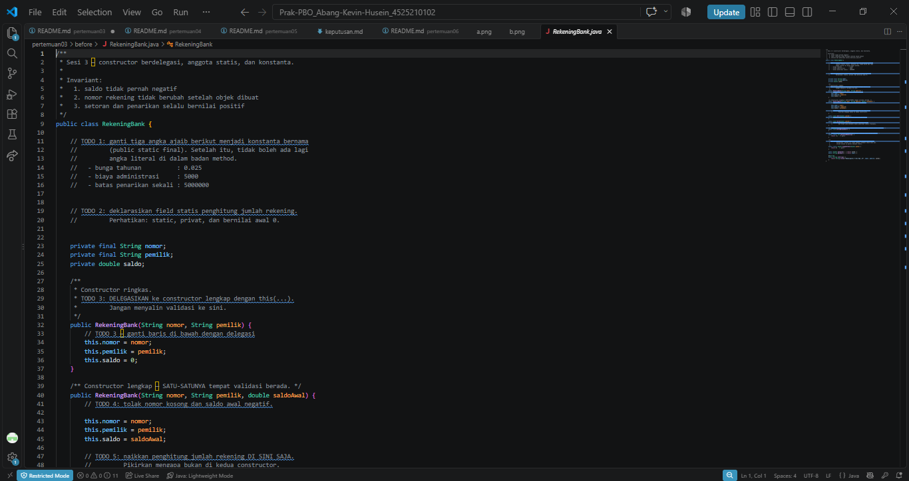
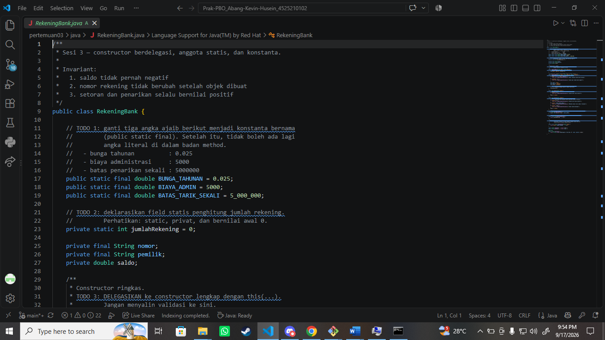
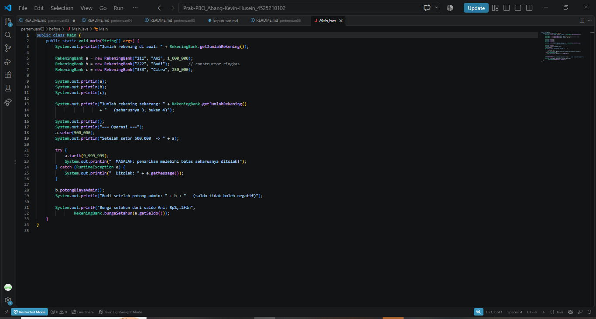
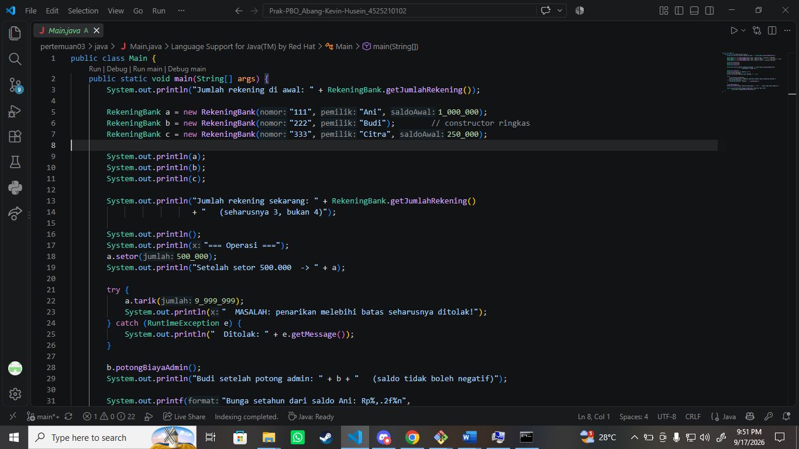
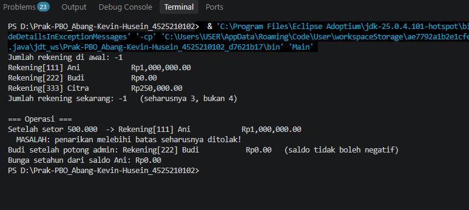
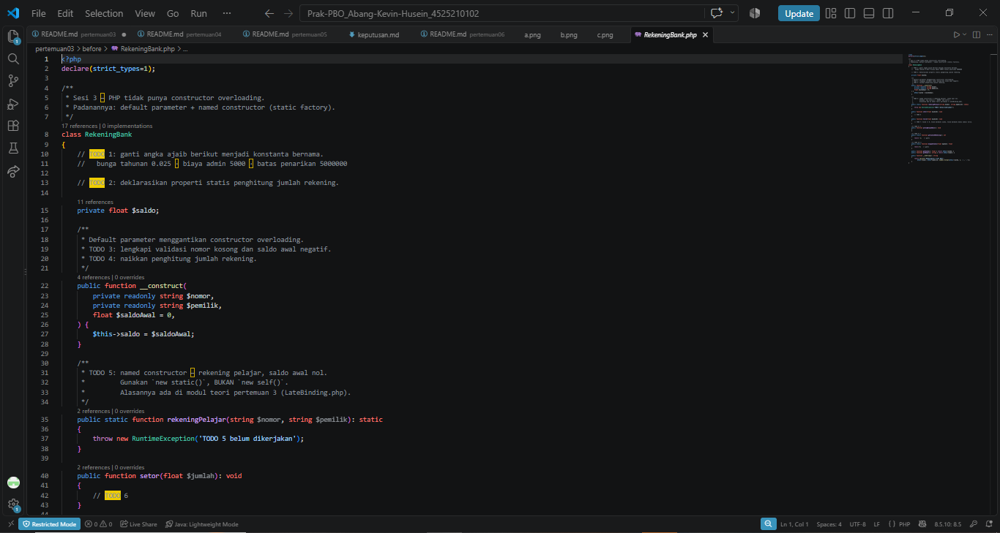
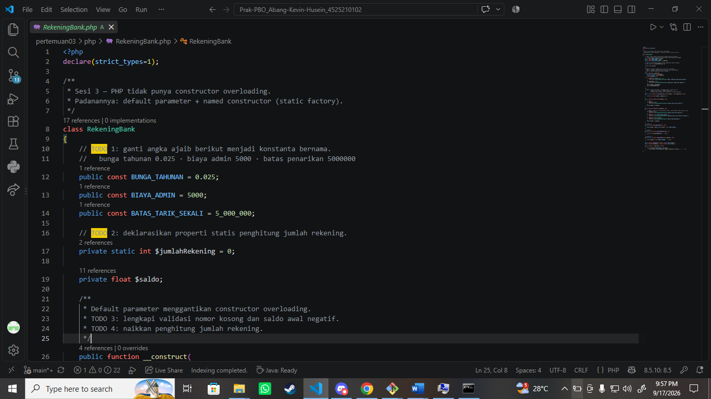
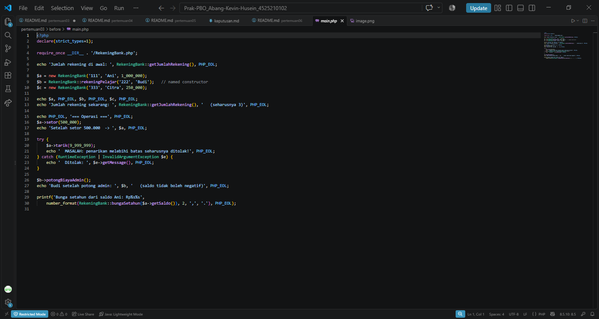
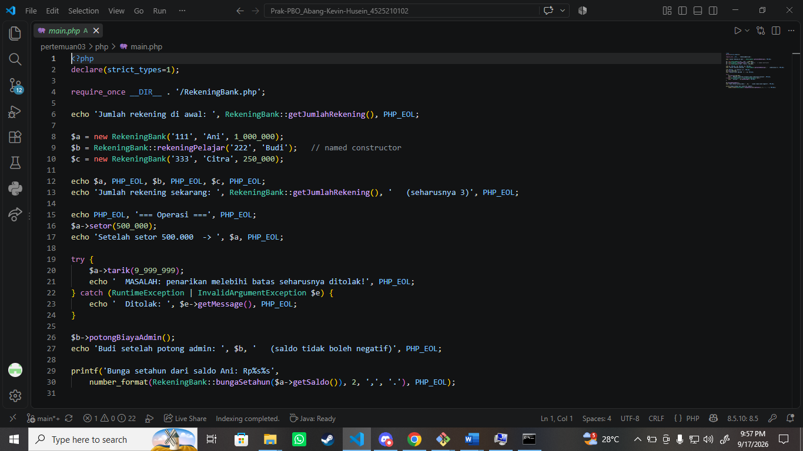
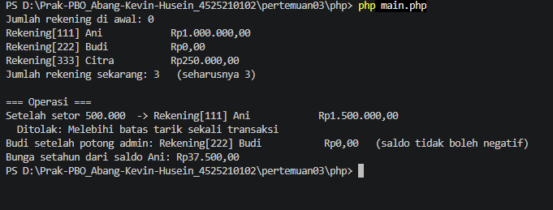

# LAPORAN PRAKTIKUM PEMROGRAMAN BERBASIS OBJEK

| Informasi Praktikan | Keterangan |
| :--- | :--- |
| **Nama** | Abang Kevin Husein |
| **NPM** | 4525210102 |
| **Kelas** | A |
| **Mata Kuliah** | Pemrograman Berorientasi Objek (PBO) |
| **Pertemuan** | 3 - Program Rekening Bank |

---

## 1. Implementasi Java

### 1.1. File: `RekeningBank.java`
**Penjelasan Kode:**
> File ini berisi pembuatan class `RekeningBank` menggunakan konsep OOP di Java. Terdapat implementasi konstanta (`BUNGA_TAHUNAN`, `BIAYA_ADMIN`, `BATAS_TARIK_SEKALI`), anggota statis (`jumlahRekening`) untuk melacak total objek rekening yang dibuat, dan *constructor* berdelegasi (menggunakan pemanggilan `this(...)`). Selain itu, class ini dilengkapi dengan validasi logika menggunakan `IllegalArgumentException` agar saldo awal tidak negatif dan nomor rekening tidak kosong.

**Bukti Eksekusi (Screenshot):**
- **Before** *(Kondisi awal / Kesalahan kompilasi)*:

- **After** *(Kondisi akhir / Eksekusi berhasil)*:

### 1.2. File: `Main.java`
**Penjelasan Kode:**
> File `Main.java` berfungsi sebagai *entry point* atau program utama untuk menjalankan dan menguji class `RekeningBank`. Program ini melakukan instansiasi objek rekening, menguji method setor, tarik (termasuk simulasi penarikan melebihi batas untuk memicu *exception* menggunakan blok `try-catch`), pemotongan biaya admin, serta memanggil method statis untuk melihat jumlah rekening dan menghitung bunga.

**Bukti Eksekusi (Screenshot):**
- **Before** *(Kondisi awal / Kesalahan kompilasi)*:

- **After** *(Kondisi akhir / Eksekusi berhasil)*:

### Output
**Output Program:**

---

## 2. Implementasi PHP

### 2.1. File: `RekeningBank.php`
**Penjelasan Kode:**
> File ini adalah versi implementasi PHP dari class `RekeningBank`. Karena PHP tidak mendukung *constructor overloading* seperti Java, class ini menggunakan *default parameter* pada constructor utama dan membuat *named constructor* statis (`rekeningPelajar()`) sebagai alternatif. Class ini juga mendefinisikan konstanta dengan keyword `public const` dan properti statis (`static $jumlahRekening`), beserta fungsi validasi yang melempar `InvalidArgumentException` jika logika bisnis dilanggar (misalnya tarik tunai melebihi batas harian).

**Bukti Eksekusi (Screenshot):**
- **Before** *(Kondisi awal / Galat logika)*:

- **After** *(Kondisi akhir / Eksekusi berhasil)*:

### 2.2. File: `main.php`
**Penjelasan Kode:**
> File `main.php` digunakan untuk menguji fungsionalitas dari `RekeningBank.php`. File ini menjalankan *test case* yang sama persis dengan versi Java-nya, meliputi pembuatan tiga objek rekening (salah satunya memanfaatkan *named constructor*), operasi penyetoran, percobaan tarik tunai yang gagal (ditangkap oleh *Exception*), serta memanggil fungsi pemotongan admin dan penghitungan bunga statis.

**Bukti Eksekusi (Screenshot):**
- **Before** *(Kondisi awal / Galat logika)*:

- **After** *(Kondisi akhir / Eksekusi berhasil)*:

### Output
**Output Program:**

---

## 3. Kesimpulan
> Praktikum pada pertemuan ini memberikan pemahaman terkait implementasi *constructor*, anggota *static*, konstanta, dan pentingnya sistem validasi pada pemrograman berbasis objek. Melalui praktik menggunakan bahasa Java dan PHP, dapat disimpulkan bahwa meskipun kedua bahasa memiliki pendekatan sintaks yang berbeda (seperti penanganan ketiadaan *constructor overloading* di PHP yang disiasati dengan *named constructor*), prinsip dasar enkapsulasi tetap sama. Keduanya sama-sama mampu mengamankan *state* sebuah objek, seperti mencegah nilai saldo menjadi negatif atau mengontrol batasan penarikan uang demi menjaga integritas data dalam program.