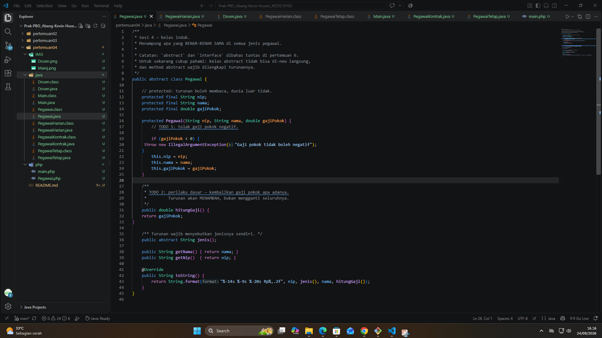
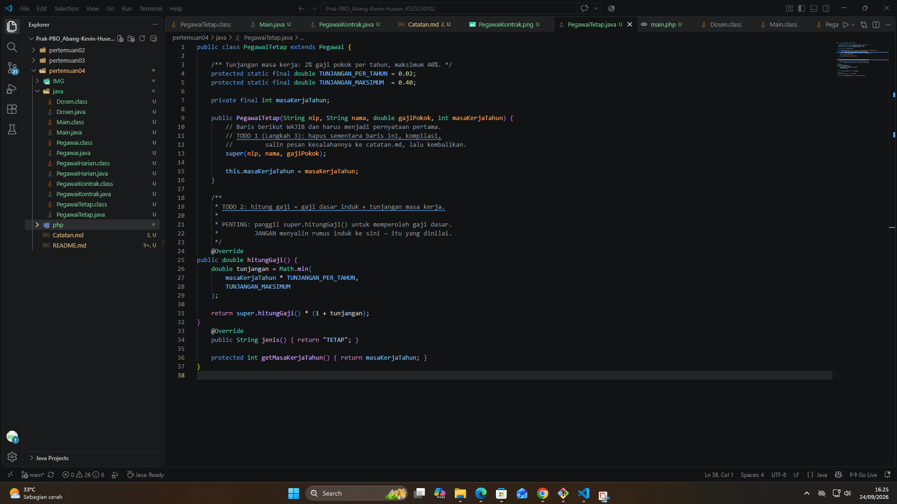
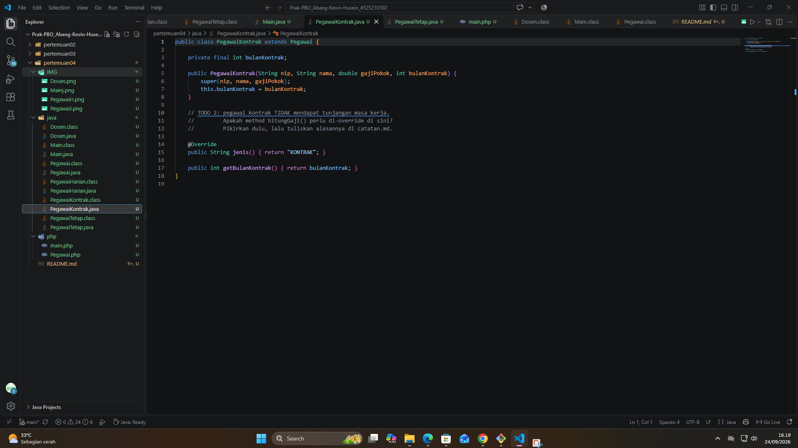
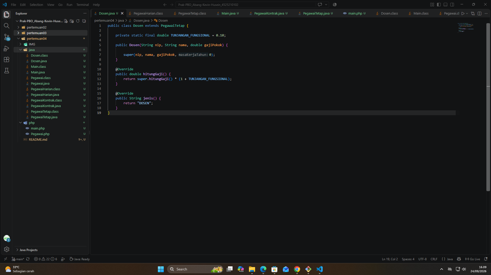
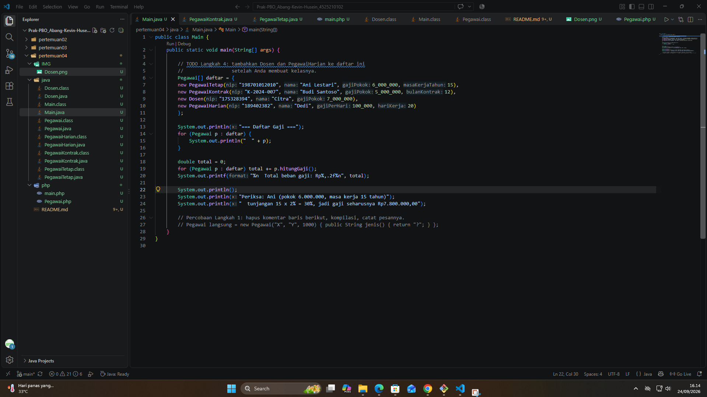
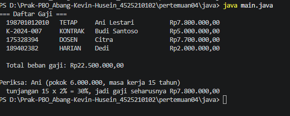
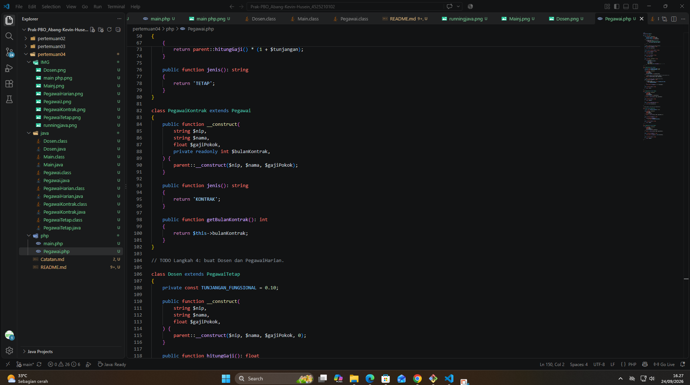
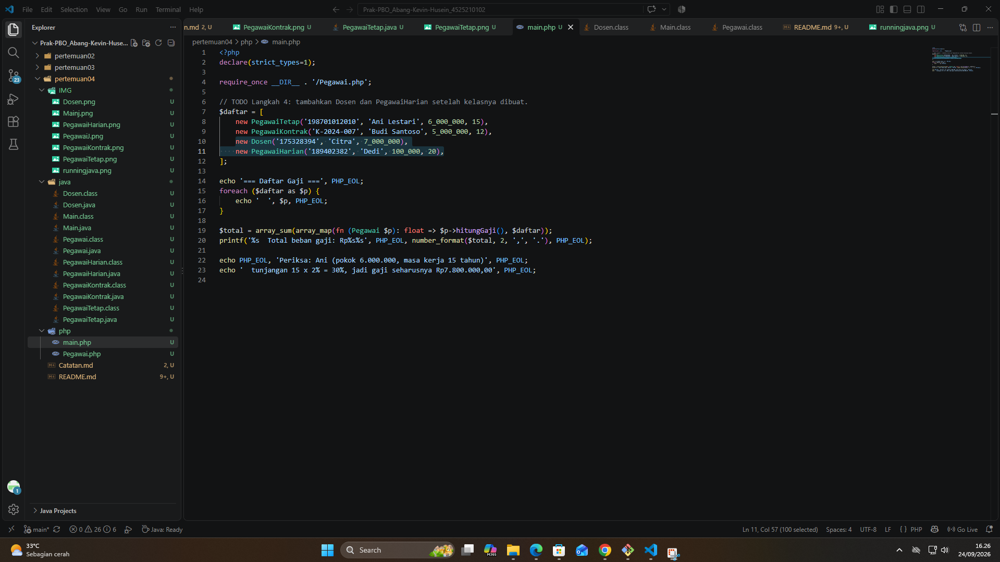
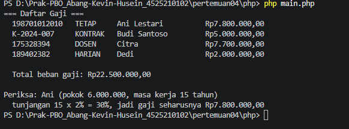

# LAPORAN PRAKTIKUM PEMROGRAMAN BERBASIS OBJEK

| Informasi Praktikan | Keterangan |
| :--- | :--- |
| **Nama** | Abang Kevin Husein |
| **NPM** | 4525210102 |
| **Kelas** | A |
| **Mata Kuliah** | Pemrograman Berorientasi Objek (PBO) |
| **Pertemuan** | 4 - Pegawai Gaji (Inheritance) |

---

## 1. Implementasi Java

### 1.1. File: `Pegawai.java`
**Penjelasan Kode:**
> File ini mendeklarasikan `Pegawai` sebagai *abstract class* atau kelas induk (*superclass*) yang menampung atribut dasar bagi semua jenis pegawai, yaitu `nip`, `nama`, dan `gajiPokok` dengan hak akses *protected* agar bisa diwariskan[cite: 7]. Terdapat validasi di dalam *constructor* untuk mencegah gaji pokok bernilai negatif, sebuah *method* konkrit `hitungGaji()` yang mengembalikan nilai gaji pokok, dan *method abstract* `jenis()` yang wajib diimplementasikan oleh seluruh kelas turunannya[cite: 7].

**Bukti Eksekusi (Screenshot):**
- **Before** *(Kondisi awal / Kesalahan kompilasi)*:

- **After** *(Kondisi akhir / Eksekusi berhasil)*:

### 1.2. File: `PegawaiTetap.java`
**Penjelasan Kode:**
> Kelas `PegawaiTetap` merupakan *subclass* (turunan) dari kelas induk `Pegawai` yang menambahkan atribut `masaKerjaTahun`[cite: 10]. Kelas ini mendemonstrasikan proses *overriding* (menimpa) fungsi pada *method* `hitungGaji()`, di mana gaji dihitung dengan cara memanggil fungsi `hitungGaji()` milik induknya (`super.hitungGaji()`) lalu dikalikan dengan tunjangan masa kerja (maksimal 40%)[cite: 10]. Pemanggilan `super(...)` pada awal *constructor* wajib dilakukan untuk menginisialisasi properti induk[cite: 10].

**Bukti Eksekusi (Screenshot):**
- **Before** *(Kondisi awal / Kesalahan kompilasi)*:

- **After** *(Kondisi akhir / Eksekusi berhasil)*:

### 1.3. File: `PegawaiKontrak.java`
**Penjelasan Kode:**
> Kelas `PegawaiKontrak` juga mewarisi kelas `Pegawai`[cite: 9]. Karena pegawai kontrak tidak menerima tunjangan masa kerja, kelas ini tidak meng-*override* method `hitungGaji()`, sehingga secara otomatis menggunakan implementasi asli dari induknya[cite: 9]. Kelas ini hanya mendefinisikan *method* `jenis()` dan menambahkan informasi spesifik berupa durasi `bulanKontrak`[cite: 9].

**Bukti Eksekusi (Screenshot):**
- **Before** *(Kondisi awal / Kesalahan kompilasi)*:

- **After** *(Kondisi akhir / Eksekusi berhasil)*:

### 1.4. File: `PegawaiHarian.java`
**Penjelasan Kode:**
> Sama seperti yang lain, kelas ini adalah turunan dari `Pegawai`[cite: 8]. Kelas ini memiliki logika penghitungan gaji yang spesifik, yaitu dengan mengalikan nilai *gaji per hari* (yang dioper ke `gajiPokok` di kelas induk) dengan atribut `hariKerja` melalui *method overriding* pada `hitungGaji()`[cite: 8]. 

**Bukti Eksekusi (Screenshot):**
- **Before** *(Kondisi awal / Kesalahan kompilasi)*:

- **After** *(Kondisi akhir / Eksekusi berhasil)*:

### 1.5. File: `Dosen.java`
**Penjelasan Kode:**
> `Dosen` mencontohkan konsep pewarisan berlapis. Alih-alih mewarisi langsung dari `Pegawai`, kelas ini mewarisi kelas `PegawaiTetap` (yang mewarisi `Pegawai`)[cite: 5]. Hal ini menyebabkan `Dosen` mendapatkan seluruh sifat dari `PegawaiTetap` (termasuk tunjangan masa kerja), lalu pada *method* `hitungGaji()`, kelas ini memanggil `super.hitungGaji()` milik `PegawaiTetap` dan menambahkannya dengan `TUNJANGAN_FUNGSIONAL` sebesar 10%[cite: 5].

**Bukti Eksekusi (Screenshot):**
- **Before** *(Kondisi awal / Kesalahan kompilasi)*:

- **After** *(Kondisi akhir / Eksekusi berhasil)*:

### 1.6. File: `Main.java`
**Penjelasan Kode:**
> File ini digunakan untuk mengeksekusi sistem menggunakan konsep *Polymorphism*[cite: 6]. Berbagai tipe objek (seperti `PegawaiTetap`, `PegawaiKontrak`, `Dosen`, dan `PegawaiHarian`) dimasukkan ke dalam satu buah *Array* bertipe induk `Pegawai`[cite: 6]. Saat dilakukan perulangan dan pemanggilan *method* `hitungGaji()`, Java secara otomatis dapat menjalankan versi *method* yang sesuai dengan tipe instansiasi asli masing-masing objek[cite: 6].

**Bukti Eksekusi (Screenshot):**
- **Before** *(Kondisi awal / Kesalahan kompilasi)*:

- **After** *(Kondisi akhir / Eksekusi berhasil)*:

### Output Java
**Output Program:**

---

## 2. Implementasi PHP

### 2.1. File: `Pegawai.php`
**Penjelasan Kode:**
> File PHP ini menggabungkan semua hierarki *class* mulai dari *abstract class* `Pegawai` (sebagai *base class*), hingga turunannya yaitu `PegawaiTetap`, `PegawaiKontrak`, `Dosen`, dan `PegawaiHarian` di dalam satu tempat[cite: 12]. Implementasi pewarisan (Inheritance) pada PHP menggunakan kata kunci `extends`, dan untuk mengakses konstruktor atau *method* induk digunakan sintaks `parent::__construct()` dan `parent::hitungGaji()`[cite: 12].

**Bukti Eksekusi (Screenshot):**
- **Before** *(Kondisi awal / Galat logika)*:

- **After** *(Kondisi akhir / Eksekusi berhasil)*:

### 2.2. File: `main.php`
**Penjelasan Kode:**
> Script ini bertindak sebagai file pengujian (seperti `Main.java`) yang memanggil `require_once` untuk memuat *file* `Pegawai.php`[cite: 11]. Data pegawai dikumpulkan ke dalam *array*, kemudian sistem melakukan iterasi untuk mencetak detail sekaligus menghitung total beban gaji keseluruhan menggunakan fungsi fungsional PHP yaitu `array_sum()` dan `array_map()` yang dipadukan dengan pemanggilan *method* polimorfik `$p->hitungGaji()`[cite: 11].

**Bukti Eksekusi (Screenshot):**
- **Before** *(Kondisi awal / Galat logika)*:

- **After** *(Kondisi akhir / Eksekusi berhasil)*:

### Output PHP
**Output Program:**

---

## 3. Kesimpulan
> Melalui praktikum pertemuan ini, dapat disimpulkan bahwa prinsip *Inheritance* (pewarisan) sangat berguna dalam konsep PBO untuk menghindari penulisan kode yang berulang (*Don't Repeat Yourself*). Atribut dan *method* umum dideklarasikan di kelas induk (*superclass*), sementara fungsionalitas unik dikelola di masing-class turunan (*subclass*). Hal ini terintegrasi erat dengan *Polymorphism*, di mana program dapat memperlakukan berbagai macam tipe objek anak selayaknya kelas induk, sekaligus tetap memanggil perilaku spesifik yang ada pada versi setiap turunannya. Hal ini terbukti berjalan serupa secara logis baik pada implementasi menggunakan bahasa Java maupun PHP.