# LAPORAN PRAKTIKUM PEMROGRAMAN BERBASIS OBJEK

| Informasi Praktikan | Keterangan |
| :--- | :--- |
| **Nama** | Abang Kevin Husein |
| **NPM** | 4525210102 |
| **Kelas** | A |
| **Mata Kuliah** | Pemrograman Berorientasi Objek (PBO) |
| **Pertemuan** | 5 - Polimorfisme (Menghitung Bangun Datar) |

---

## 1. Implementasi Java

### 1.1. File: `AntiPattern.java` & `AntiPatternRefaktor.java`
**Penjelasan Kode:**
> File `AntiPattern.java` mencontohkan desain kode yang buruk karena tidak menerapkan polimorfisme, melainkan menggunakan logika `if-else` dan pengecekan tipe `instanceof` secara manual untuk menghitung luas[cite: 13]. Hal ini tidak efisien karena jika ada tipe bangun baru, kita wajib mengubah logika utamanya[cite: 13]. Masalah ini diselesaikan di `AntiPatternRefaktor.java` melalui pembuatan `interface Bangun` dan pendelegasian fungsi penghitungan `hitungLuas()` kepada masing-masing tipe data (`record`), sehingga fungsi utamanya berjalan secara polimorfik tanpa perlu mengecek tipe objek satu-persatu[cite: 14].

**Bukti Eksekusi (Screenshot):**
- **Before** *(Kondisi awal / Kesalahan kompilasi)*:

- **After** *(Kondisi akhir / Eksekusi berhasil)*:
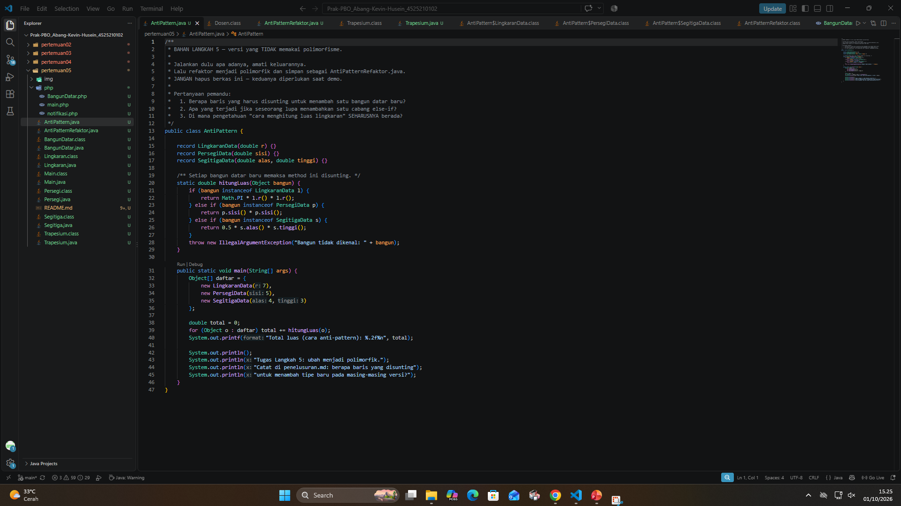
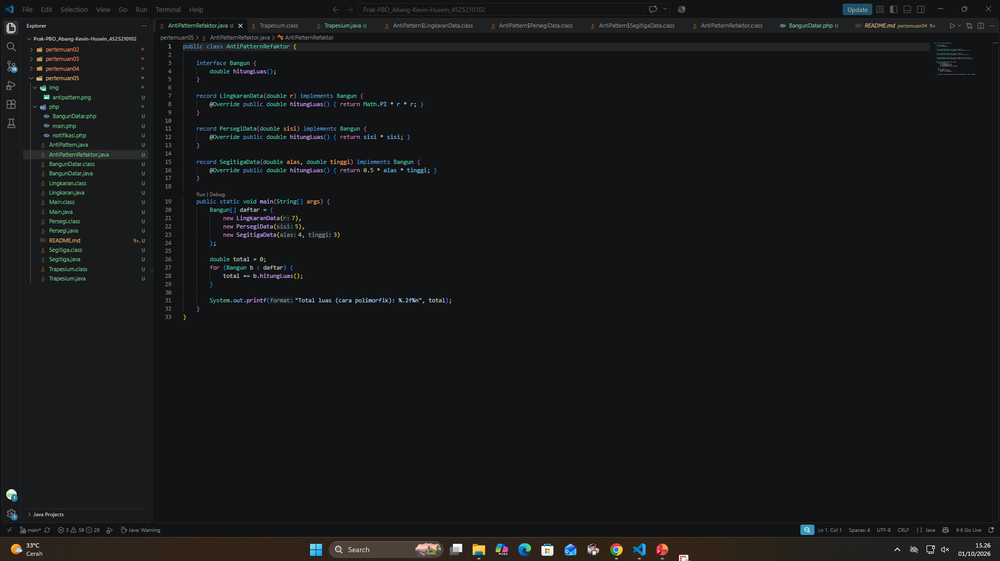

### 1.2. File: `BangunDatar.java`
**Penjelasan Kode:**
> File ini bertindak sebagai kelas abstrak (*abstract class*) induk yang menetapkan sebuah **kontrak** bagi semua bangun datar[cite: 15]. Kelas ini mendeklarasikan *method abstract* `luas()` dan `keliling()` yang wajib diimplementasikan oleh turunan-turunannya[cite: 15]. Fitur *Dynamic Method Dispatch* terlihat jelas pada fungsi `toString()` di kelas ini, di mana meskipun ia berada di kelas induk, ia dapat memanggil dan mengeksekusi metode `luas()` dan `keliling()` dari kelas spesifik turunannya saat program berjalan[cite: 15].

**Bukti Eksekusi (Screenshot):**
- **Before** *(Kondisi awal / Kesalahan kompilasi)*:

- **After** *(Kondisi akhir / Eksekusi berhasil)*:
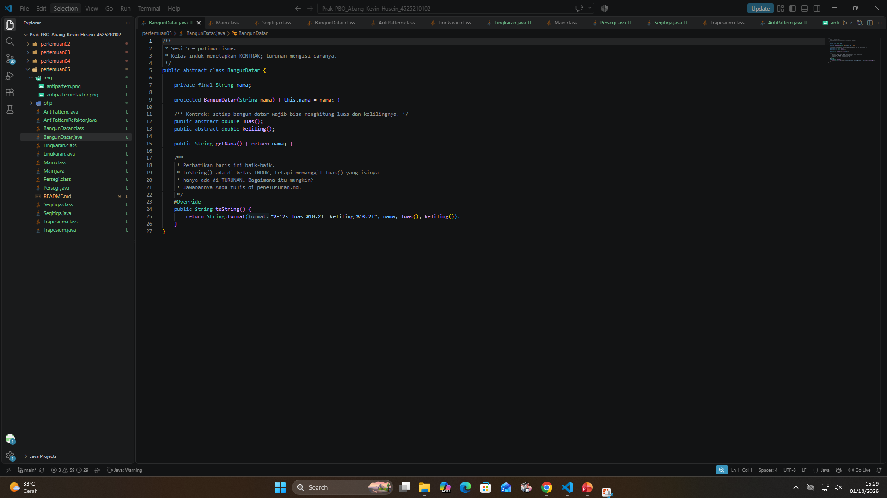

### 1.3. File: `Lingkaran.java` & `Persegi.java`
**Penjelasan Kode:**
> Kelas-kelas ini adalah turunan dari `BangunDatar`[cite: 16, 18]. Kedua kelas ini memberikan implementasi nyata pada fungsi `luas()` dan `keliling()`. Pada `Lingkaran`, digunakan konstanta bawaan Java yaitu `Math.PI` untuk akurasi perhitungan jari-jari[cite: 16]. Di masing-masing *constructor*, dipasang validasi (melempar `IllegalArgumentException`) untuk memastikan nilai yang dimasukkan tidak sama dengan atau kurang dari nol[cite: 16, 18].

**Bukti Eksekusi (Screenshot):**
- **Before** *(Kondisi awal / Kesalahan kompilasi)*:

- **After** *(Kondisi akhir / Eksekusi berhasil)*:
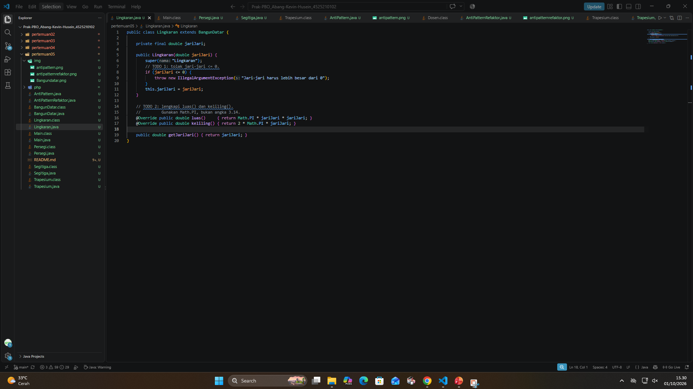
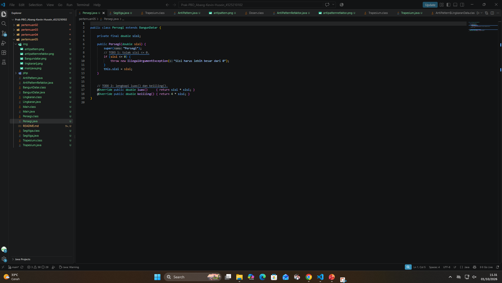

### 1.4. File: `Segitiga.java` & `Trapesium.java`
**Penjelasan Kode:**
> `Segitiga` dan `Trapesium` turut mewarisi `BangunDatar`[cite: 19, 20]. Validasi pada `Segitiga` lebih kompleks karena selain mengecek nilai negatif, sistem juga memeriksa aturan ketimpangan apakah panjang tiga sisi valid untuk membentuk sebuah segitiga (misal, `a + b <= c`)[cite: 19]. Perhitungan luas pada segitiga sembarang ini dilakukan menggunakan Rumus Heron `Math.sqrt(s * (s - a) * (s - b) * (s - c))`[cite: 19]. 

**Bukti Eksekusi (Screenshot):**
- **Before** *(Kondisi awal / Kesalahan kompilasi)*:

- **After** *(Kondisi akhir / Eksekusi berhasil)*:
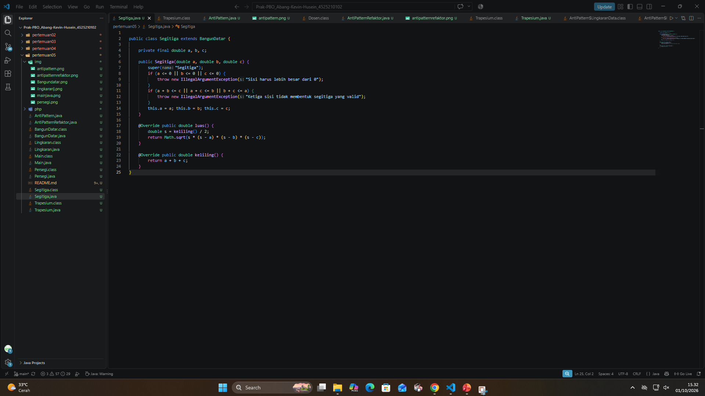
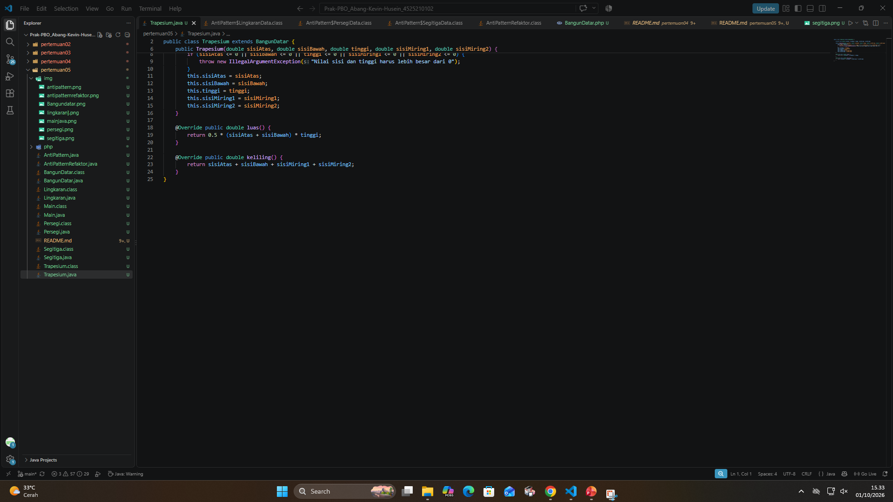

### 1.5. File: `Main.java`
**Penjelasan Kode:**
> File uji `Main.java` ini mendemonstrasikan **Upcasting**, di mana objek turunan (Lingkaran, Persegi, Segitiga, Trapesium) dimasukkan ke dalam tipe array kelas induk `BangunDatar[]`[cite: 17]. Saat diiterasi, Java secara polimorfik menjalankan kalkulasi luas pada metode milik turunan yang bersangkutan tanpa perlu pemeriksaan tipe[cite: 17]. Program juga mendemonstrasikan **Downcasting** yang aman dengan pola `instanceof Lingkaran l` untuk mencetak atribut `jariJari` yang hanya spesifik dimiliki kelas `Lingkaran`[cite: 17].

**Bukti Eksekusi (Screenshot):**
- **Before** *(Kondisi awal / Kesalahan kompilasi)*:

- **After** *(Kondisi akhir / Eksekusi berhasil)*:
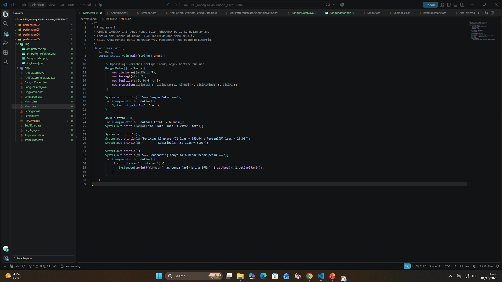

### Output Java
**Output Program:**
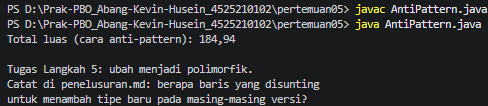
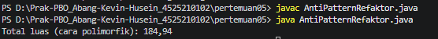
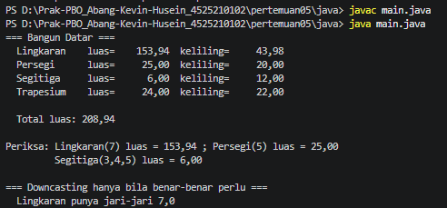

---

## 2. Implementasi PHP

### 2.1. File: `BangunDatar.php`
**Penjelasan Kode:**
> Berkas ini menggabungkan kelas `BangunDatar` beserta turunannya (`Lingkaran`, `Persegi`, `Segitiga`, dan `Trapesium`) dalam satu file PHP[cite: 22]. Sama seperti versi Java, logika polimorfisme PHP dijaga dengan `abstract class` yang mewajibkan penulisan fungsi `luas()` dan `keliling()`[cite: 22]. Validasi nilai nol, implementasi pengecekan integritas pembentukan segitiga (rumus Heron dengan `sqrt()`), serta pemanfaatan konstanta matematika `M_PI` diadaptasikan utuh sesuai standar exception `InvalidArgumentException` di PHP[cite: 22].

**Bukti Eksekusi (Screenshot):**
- **Before** *(Kondisi awal / Galat logika)*:

- **After** *(Kondisi akhir / Eksekusi berhasil)*:
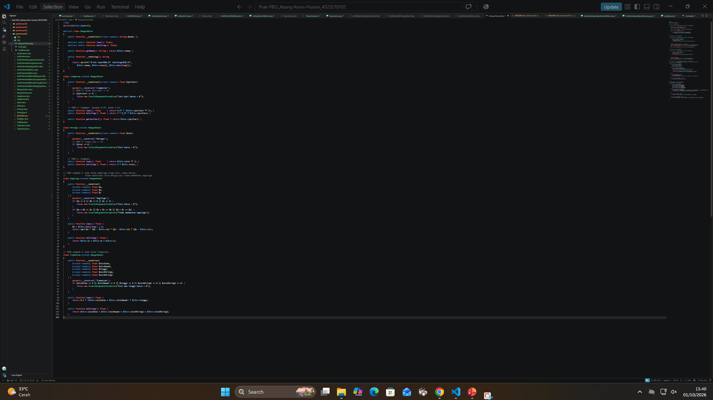

### 2.2. File: `main.php`
**Penjelasan Kode:**
> Script ini melakukan inisiasi terhadap kumpulan kelas `BangunDatar` dalam variabel tipe array `$daftar`[cite: 23]. Pengujian polimorfik dilakukan dalam sebuah *looping* menggunakan *higher-order function* bawaan PHP `array_map` bersama *arrow function* `fn (BangunDatar $b): float => $b->luas()` yang akan dijumlahkan menggunakan `array_sum`[cite: 23].

**Bukti Eksekusi (Screenshot):**
- **Before** *(Kondisi awal / Galat logika)*:

- **After** *(Kondisi akhir / Eksekusi berhasil)*:
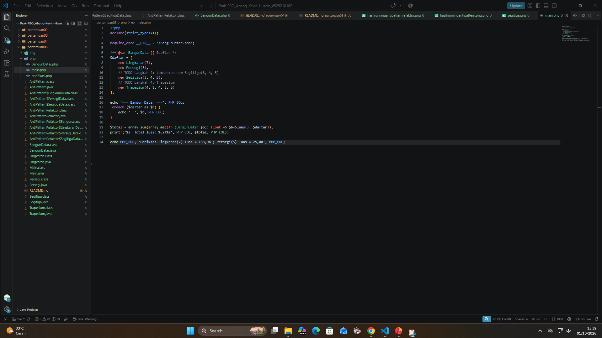

### 2.3. File: `notifikasi.php`
**Penjelasan Kode:**
> File ini berisi latihan mandiri untuk menerapkan polimorfisme murni menggunakan *abstract class* `Notifikasi` beserta tiga turunannya: `Email`, `SMS`, dan `WhatsApp`[cite: 24]. Ketiga turunan tersebut diwajibkan menulis secara konkrit fungsi abstrak `kirim()` dan `saluran()` yang ditetapkan oleh kelas induk[cite: 24]. Pada bagian eksekusi, diterapkan sebuah metode iteratif `kirimSemua()` yang langsung memanggil `$notifikasi->kirim()` tanpa melakukan pemeriksaan tipe manual (`instanceof` atau `switch/match`), membuktikan bahwa sistem sepenuhnya polimorfik dan bersih[cite: 24].

**Bukti Eksekusi (Screenshot):**
- **Before** *(Kondisi awal / Galat logika)*:

- **After** *(Kondisi akhir / Eksekusi berhasil)*:
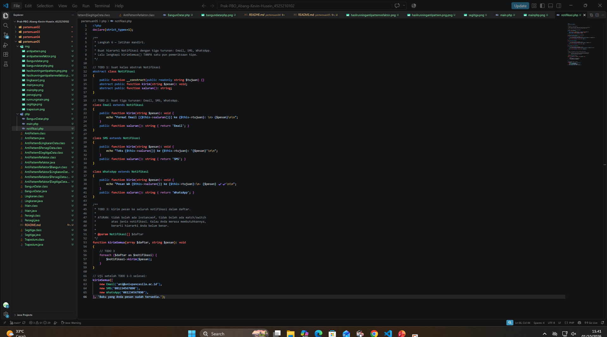

### Output PHP
**Output Program:**
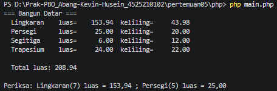

---

## 3. Kesimpulan
> Dari praktikum pertemuan ini, dapat disimpulkan bahwa *Polymorphism* (polimorfisme) adalah pilar OOP yang sangat penting untuk menciptakan kode yang rapi, dinamis, dan *scalable* (mudah diperluas kapabilitasnya). Dengan berpegang pada sebuah "kontrak" yang ditentukan oleh kelas Abstrak (maupun Interface), kita dapat memproses berbagai objek turunan yang saling berbeda secara seragam tanpa menyulitkan kode utama dengan pemeriksaan tipe secara manual (menghindari pola *Anti-Pattern* rentetan `if-else` atau `switch`). Praktik ini terbukti berfungsi dengan baik, baik saat diimplementasikan menggunakan bahasa Java maupun PHP.