# LAPORAN PRAKTIKUM PEMROGRAMAN BERBASIS OBJEK

| Informasi Praktikan | Keterangan |
| :--- | :--- |
| **Nama** | Abang Kevin Husein |
| **NPM** | 4525210102 |
| **Kelas** | A |
| **Mata Kuliah** | Pemrograman Berorientasi Objek (PBO) |
| **Pertemuan** | 6 - Abstraksi, Interface, Enum, dan Trait |
| **Tanggal** | 10 Oktober 2026 |

---

## 1. Implementasi Java

### 1.1. File: `Fuelable.java`
**Penjelasan Kode:**
> `Fuelable` adalah sebuah *interface* yang mendefinisikan kontrak bagi objek yang dapat diisi bahan bakar[cite: 25]. Interface ini memuat method `isiBahanBakar()`, `kapasitasTangki()`, dan `tipeBahanBakar()`[cite: 25]. Pemisahan interface ini dari `Movable` menerapkan *Interface Segregation Principle* (ISP) agar kelas yang tidak butuh bahan bakar (seperti `Sepeda`) tidak dipaksa mengimplementasikannya[cite: 25].

**Bukti Eksekusi (Screenshot):**
- **Before** *(Kondisi awal / Kesalahan kompilasi)*:

- **After** *(Kondisi akhir / Eksekusi berhasil)*:
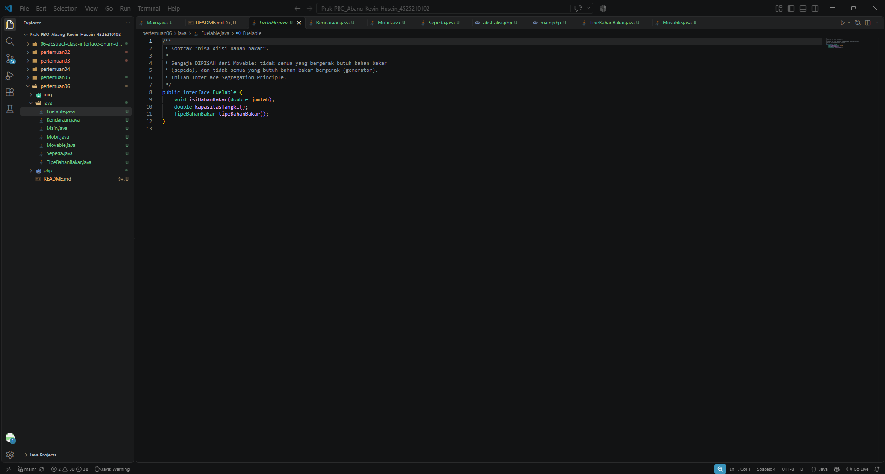

### 1.2. File: `Kendaraan.java`
**Penjelasan Kode:**
> `Kendaraan` merupakan *abstract class* yang berfungsi sebagai cetak biru dasar untuk semua jenis kendaraan[cite: 26]. Kelas ini menampung atribut umum seperti `merek` dan `tahun`, method konkrit `umur()`, serta *abstract method* `jumlahRoda()` yang wajib diimplementasikan secara spesifik oleh kelas turunannya[cite: 26].

**Bukti Eksekusi (Screenshot):**
- **Before** *(Kondisi awal / Kesalahan kompilasi)*:

- **After** *(Kondisi akhir / Eksekusi berhasil)*:
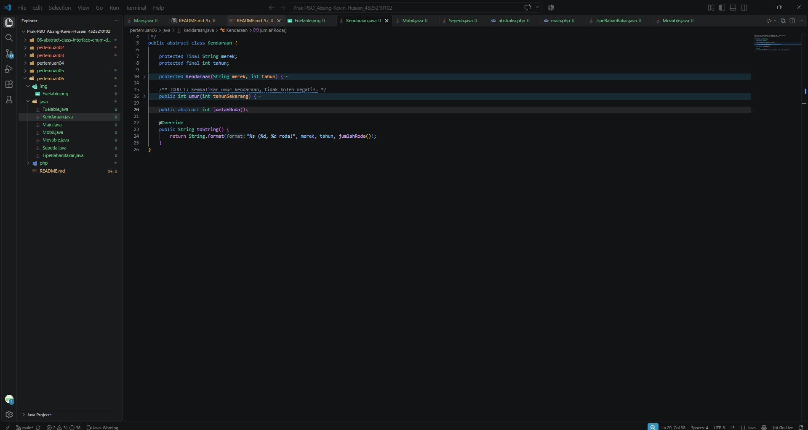

### 1.3. File: `Movable.java`
**Penjelasan Kode:**
> Interface `Movable` mendefinisikan kemampuan objek untuk bergerak lewat method `bergerak()` dan `kecepatanMaksimum()`[cite: 29]. Terdapat juga *default method* `ringkasanGerak()` (fitur Java 8+) yang memberikan implementasi default untuk merangkai teks kecepatan tanpa memaksa kelas turunannya untuk menulis ulang kode tersebut[cite: 29].

**Bukti Eksekusi (Screenshot):**
- **Before** *(Kondisi awal / Kesalahan kompilasi)*:

- **After** *(Kondisi akhir / Eksekusi berhasil)*:
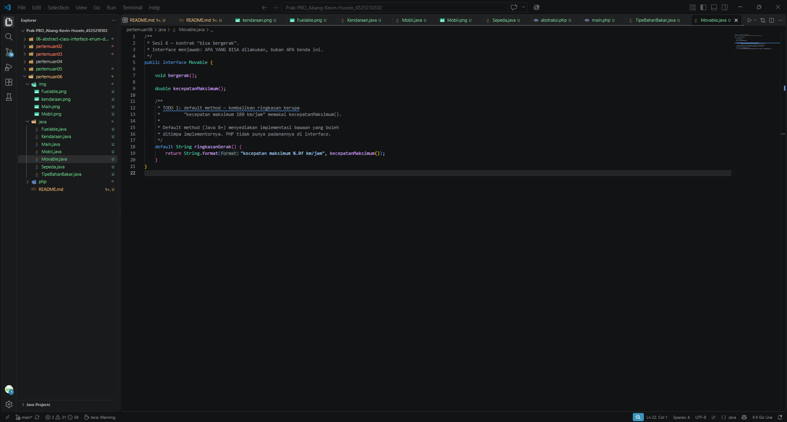

### 1.4. File: `Mobil.java`
**Penjelasan Kode:**
> Kelas `Mobil` adalah kelas konkrit yang mewarisi (*extends*) `Kendaraan` serta mengimplementasikan dua interface (*implements*) sekaligus, yaitu `Movable` dan `Fuelable`[cite: 28]. Kelas ini mendefinisikan kapasitas tangki, kecepatan maksimum, serta logika pengisian bahan bakar yang aman (menolak nilai `<= 0` dan tidak boleh melebihi kapasitas tangki)[cite: 28].

**Bukti Eksekusi (Screenshot):**
- **Before** *(Kondisi awal / Kesalahan kompilasi)*:

- **After** *(Kondisi akhir / Eksekusi berhasil)*:
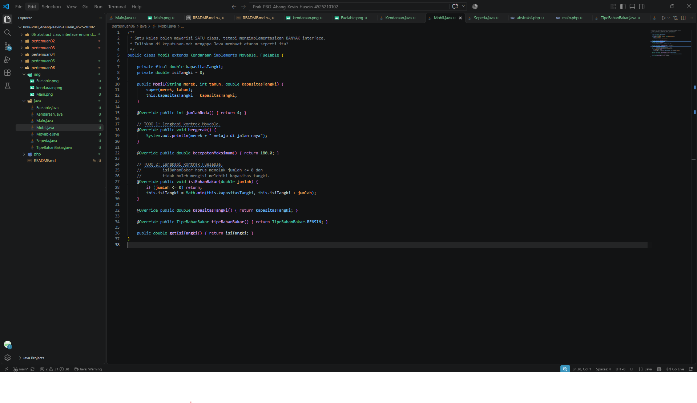

### 1.5. File: `Sepeda.java`
**Penjelasan Kode:**
> Kelas `Sepeda` mewarisi `Kendaraan` dan mengimplementasikan `Movable`, namun **TIDAK** mengimplementasikan `Fuelable`[cite: 30]. Hal ini menunjukkan fleksibilitas dari arsitektur *interface*, di mana sepeda dapat bergerak secara logis, tetapi tidak memerlukan fungsionalitas terkait bahan bakar[cite: 30].

**Bukti Eksekusi (Screenshot):**
- **Before** *(Kondisi awal / Kesalahan kompilasi)*:

- **After** *(Kondisi akhir / Eksekusi berhasil)*:
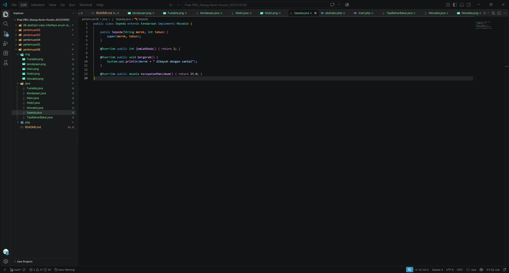

### 1.6. File: `TipeBahanBakar.java`
**Penjelasan Kode:**
> `TipeBahanBakar` adalah sebuah *enum* yang tidak hanya menyimpan konstanta (`BENSIN`, `SOLAR`, `LISTRIK`), tetapi juga mendefinisikan atribut (`label`, `hargaPerSatuan`) serta method perilaku seperti `biayaPengisian()` dan logika perbandingan `ramahLingkungan()`[cite: 31].

**Bukti Eksekusi (Screenshot):**
- **Before** *(Kondisi awal / Kesalahan kompilasi)*:

- **After** *(Kondisi akhir / Eksekusi berhasil)*:
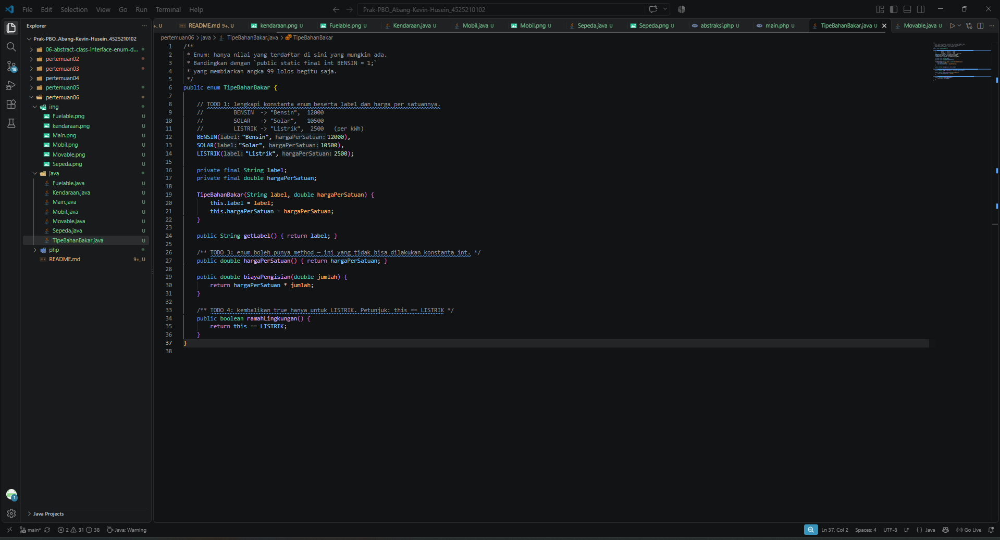

### 1.7. File: `Main.java`
**Penjelasan Kode:**
> File `Main.java` berfungsi sebagai *entry point* untuk menguji seluruh kelas Java[cite: 27]. Di dalamnya terdapat fungsi `isiPenuh(Fuelable kendaraan)` yang memanfaatkan kekuatan polimorfisme dari *interface*, sehingga fungsi ini secara fleksibel bisa menerima objek apa pun yang mengimplementasikan `Fuelable` tanpa perlu tahu kelas aslinya[cite: 27].

**Bukti Eksekusi (Screenshot):**
- **Before** *(Kondisi awal / Kesalahan kompilasi)*:

- **After** *(Kondisi akhir / Eksekusi berhasil)*:
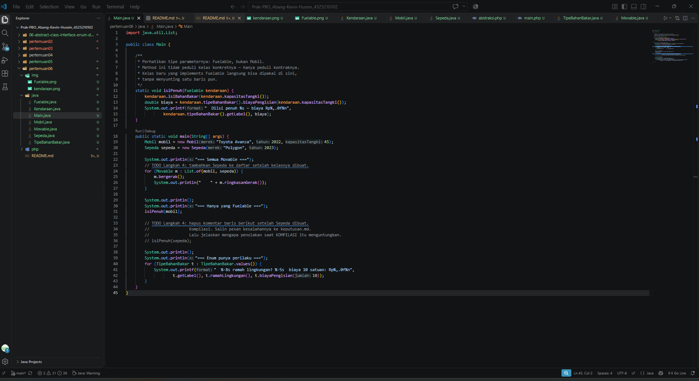

### Output Java
**Output Program:**
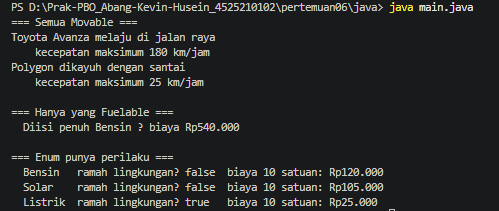
> **Penjelasan Output:** Program berhasil mengeksekusi metode pergerakan dari daftar kendaraan, menampilkan ringkasan gerak, menghitung biaya isi penuh bahan bakar mobil, serta menampilkan daftar enum tipe bahan bakar beserta parameter harga dan status ramah lingkungannya.

---

## 2. Implementasi PHP

### 2.1. File: `abstraksi.php`
**Penjelasan Kode:**
> File ini berisi definisi lengkap struktur arsitektur tingkat lanjut pada PHP yang meliputi interface `Movable` & `Fuelable`, `TipeBahanBakar` (*Backed Enum* PHP 8.1+), *Trait* `Loggable`, *Abstract Class* `Kendaraan`, serta kelas konkrit `Mobil`, `Sepeda`, dan `Pesanan`[cite: 32]. Penggunaan fitur *Trait* `Loggable` menunjukkan konsep *horizontal code reuse* di PHP, di mana kelas `Mobil` dan `Pesanan` (yang tidak sekerabat secara pewarisan) dapat membagikan kemampuan pencatatan *log* secara mandiri dan identik[cite: 32].

**Bukti Eksekusi (Screenshot):**
- **Before** *(Kondisi awal / Galat logika)*:

- **After** *(Kondisi akhir / Eksekusi berhasil)*:
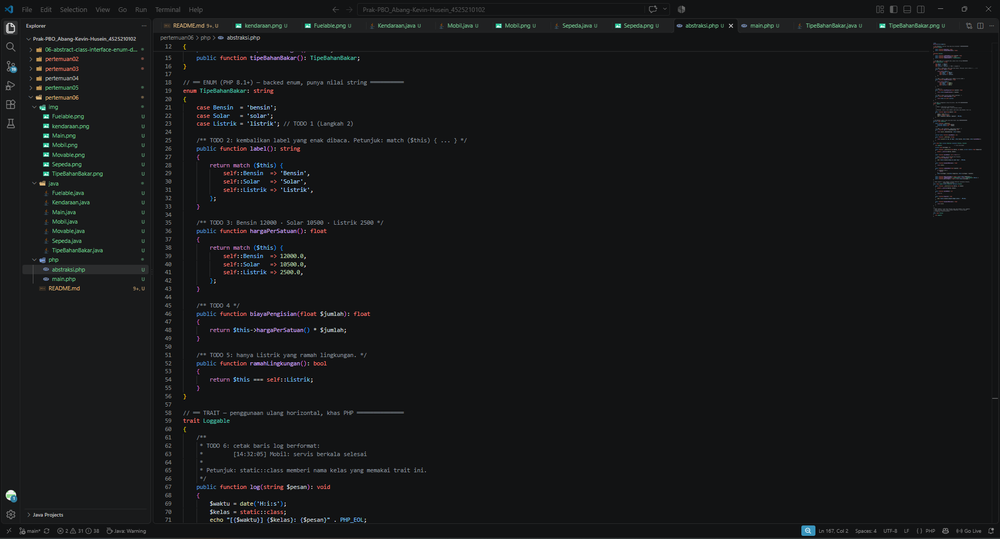

### 2.2. File: `main.php`
**Penjelasan Kode:**
> Berfungsi sebagai skrip eksekusi utama PHP yang mengimpor `abstraksi.php`[cite: 33]. Skrip ini menjalankan iterasi terhadap *array* objek `Movable`, menggunakan fungsi independen `isiPenuh()`, melakukan perulangan atas nilai-nilai Enum `TipeBahanBakar::cases()`, serta mendemonstrasikan pengaplikasian trait `$objek->log()` secara instan pada objek `Mobil` dan `Pesanan`[cite: 33].

**Bukti Eksekusi (Screenshot):**
- **Before** *(Kondisi awal / Galat logika)*:

- **After** *(Kondisi akhir / Eksekusi berhasil)*:
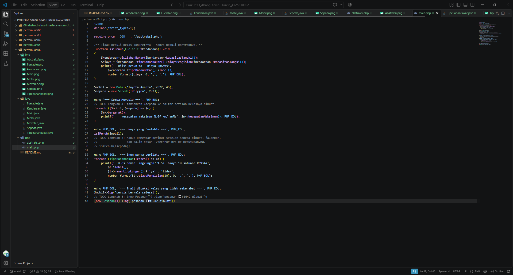

### Output PHP
**Output Program:**
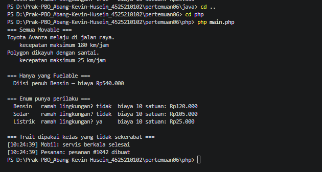
> **Penjelasan Output:** Eksekusi program PHP berjalan lancar, mampu memproses pergerakan kecepatan maksimum (Mobil dan Sepeda), menolak *error* yang tidak sesuai tipe, mencetak harga Enum, dan berhasil mencetak baris log waktu berformat lewat bantuan sifat Trait.

---

## 3. Catatan Keputusan / Exception Handling
**File: `Keputusan.md`**
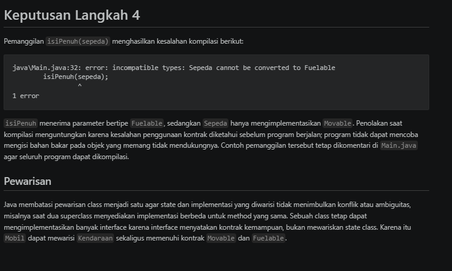

---

## 4. Kesimpulan
> Praktikum pertemuan keenam (terakhir) ini berhasil merangkum pilar-pilar penting dalam mendesain arsitektur PBO yang solid (*Solid Principles*), utamanya *Interface Segregation Principle*. Dengan menggunakan *Interface*, kita mendefinisikan apa yang *bisa dilakukan* objek, bukan apa *wujud* objek tersebut, memberikan fleksibilitas tanpa batas. Fitur-fitur lanjutan seperti *Enum* terbukti efektif untuk membungkus tipe data yang statis namun memerlukan perilaku khusus. Selain itu, fitur *Trait* di PHP sangat membantu dalam menerapkan fungsi (*method*) serbaguna untuk kelas-kelas yang tidak berada dalam hierarki pewarisan (mencegah komplikasi pewarisan ganda).